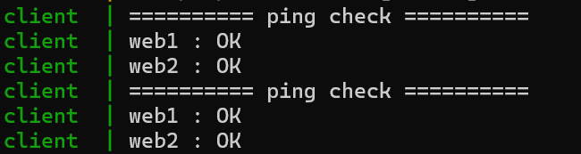

# Docker Ping Monitor

Docker composeで構築した仮想ネットワーク上で、pythonを用いて2台のコンテナへのping監視を行う

## 構成
- web1 : nginx server
- web2 : nginx server
- client : ping監視クライアント

## 起動
```
docker compose up --build
```

## 停止
'Ctrl + C'

## 結果


## 機能
- コンテナ間通信確認
- 10秒ごとにping監視
- OK/NG表示