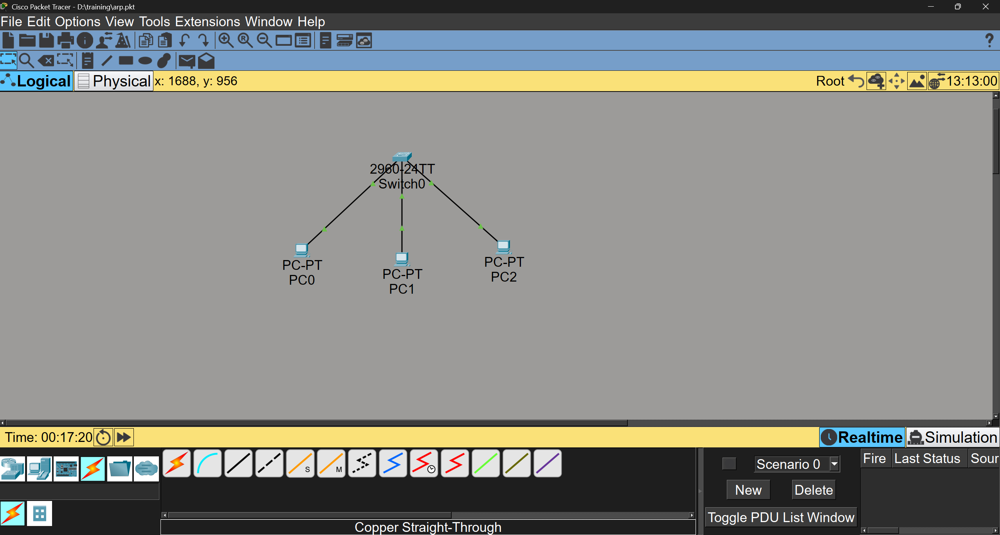
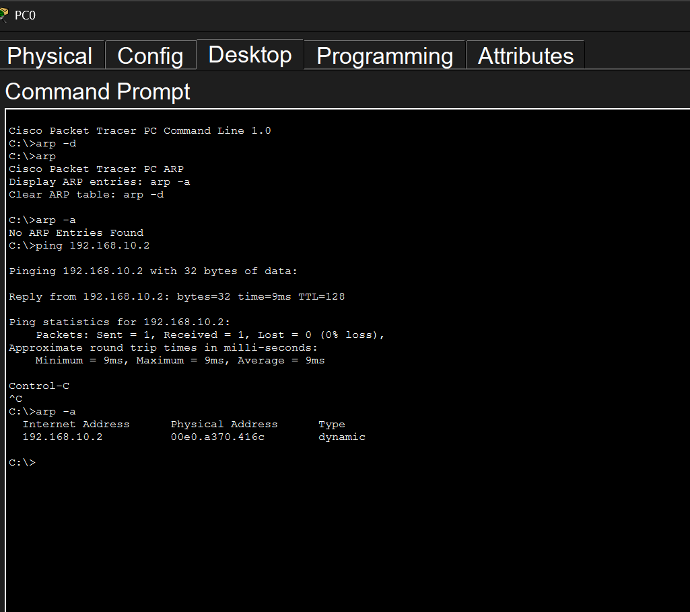

# Cisco Packet TracerでARP

## 構成図

## ネットワーク構成
| 機器 | IPアドレス|
|------|-----------|
| PC0  | 192.168.10.1 |
| PC1  | 192.168.10.2 |
| PC2  | 192.168.10.3 |

## 動作確認
- PC0 -> PC1 ARPテーブルが作られ、ping成功

## 手順
1. 各PCにIPアドレスを設定
2. PC0のコマンドプロンプトに入り、arp -aでARPテーブルを確認し、登録されていればarp -d で削除。
3. RealtimeからSimulationに変更し、PC0のコマンドプロンプトで ping 192.168.10.2 とする
4. PLAY CONTROLSでPLAYをクリック
5. ARP要求が流れていき、Simulationが完了したらPC0のコマンドプロンプトでCtrl+Cで終了

## ARPの流れ
1. PC0がSwitchに向けてARP要求をブロードキャストで送信
2. SwitchはMACアドレステーブルにPC0を登録し、ARP要求をフラッディング。
3. PC1はIPアドレスから自分宛てのARP要求と判断し、フレームを受け入れ、ARPテーブルにPC0を登録。PC2は自分宛てではないので破棄
4. PC1は自分のMACアドレスを含めたARP応答を作成。このとき、宛先のPC0のMACアドレス・IPアドレスは分かっているのでユニキャスト通信で送信する
5. SwitchはPC1のARP応答を受け取り、MACアドレステーブルにPC1を登録。その後、PC0に送信する。
6. PC0はARP応答を受け取り、自分のARPテーブルにPC1のMACアドレスを書き込む。　以上