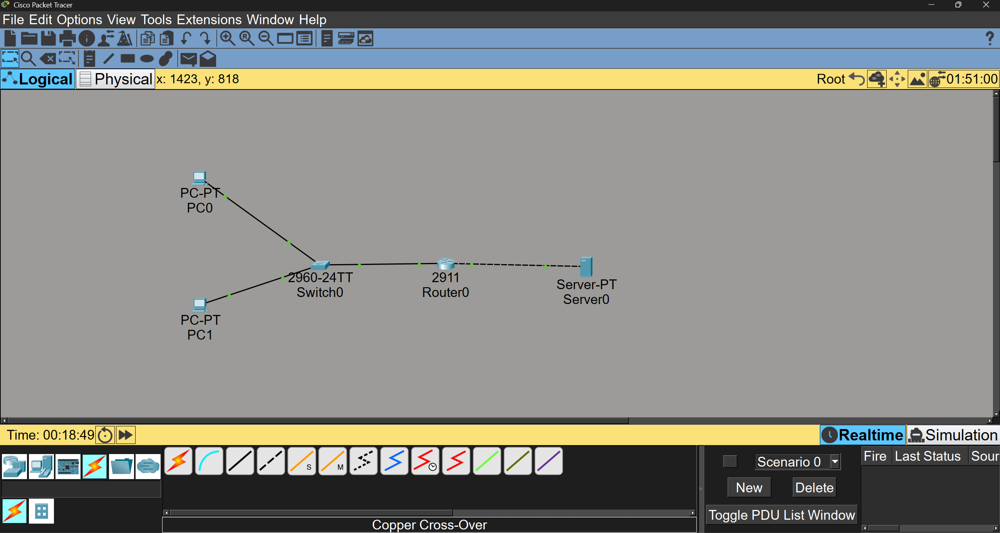
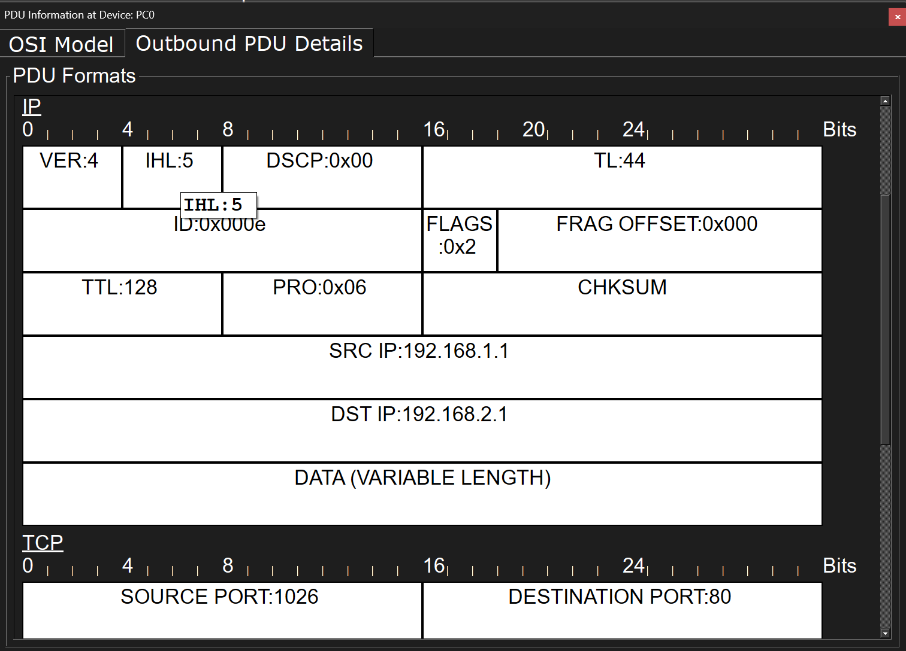
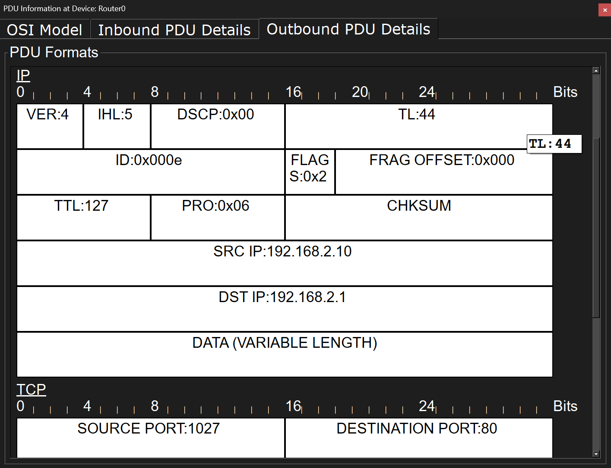
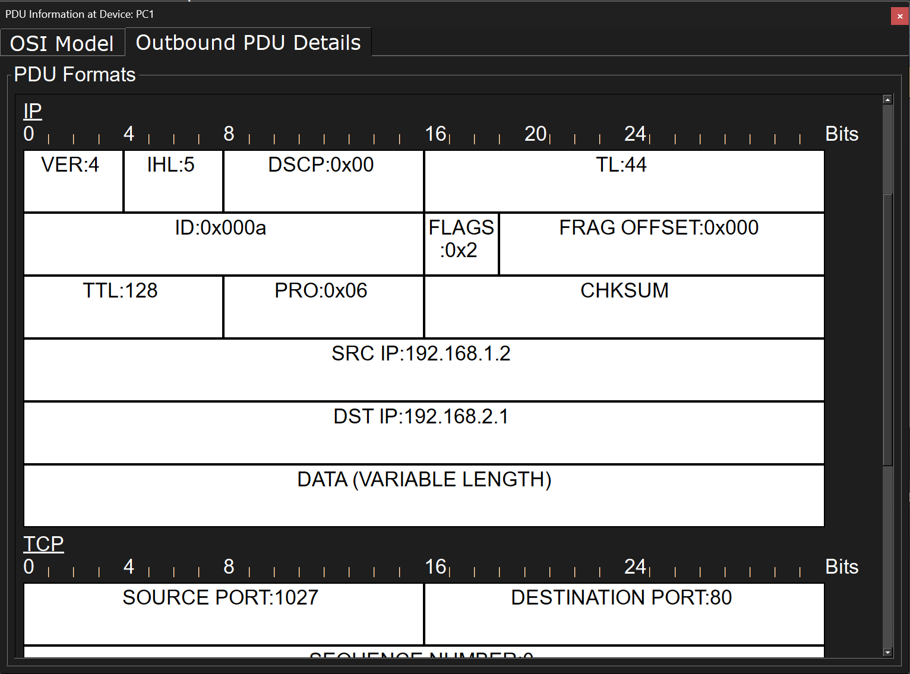
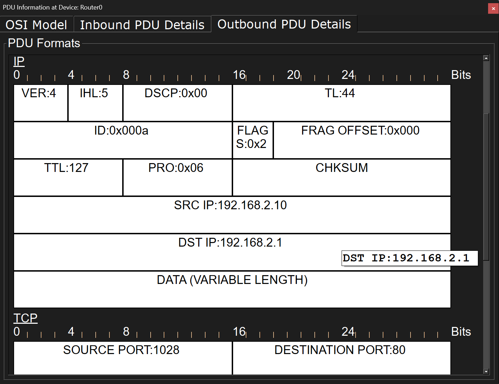
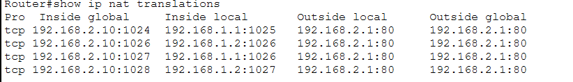

# Cisco Packet TracerでNAPT(IPマスカレード)

## 検証目的
単一のグローバルIPアドレスを用いて、複数の内部ホストが同時に外部ネットワークと通信する際の挙動（ポート番号の変換と識別）を確認する。

## 構成図


## ネットワーク構成
| 区分 | 機器 | IPアドレス| 役割 |
|--------|------|-----------| ---|
| Inside | PC0 | 192.168.1.1 | クライアント1 |
| Inside | PC1 | 192.168.1.2 | クライアント2 |
| Gateway | Router |  192.168.1.10(Giga0/0) / 192.168.2.10(Giga0/1) | NAPTルーター|
| Outside | Server | 192.168.2.1 | Webサーバー |


## 結果
- PC0での送信元IPアドレスが 192.168.1.1 → 192.168.2.10 に、送信元ポート番号が 1026 → 1027 に変換



- PC1での送信元IPアドレスが 192.168.1.2 → 192.168.2.10 に、送信元ポート番号が 1027 → 1028 に変換



## NATテーブルの確認
- show ip nat translations でテーブルを確認。Inside GlobalとInside Localの紐づけが正しく管理されていることを確認


## 設定内容

### Router
1. GigabitEthernet0/0 をInside
```
interface GigabitEthernet0/0
ip nat inside
exit
```
2. GigabitEthernet0/1 をOutside
```
interface GigabitEthernet0/1
ip nat outside
exit
```
3. 0.0.0.255はワイルドカードマスク。このマスクで指定した範囲(192.168.1.1 ~ 192.168.1.254)に含まれるホストはすべてNAPTの対象
```
access-list 10 permit 192.168.1.0 0.0.0.255
ip nat inside source list 10 interface GigabitEthernet0/1 overload
```