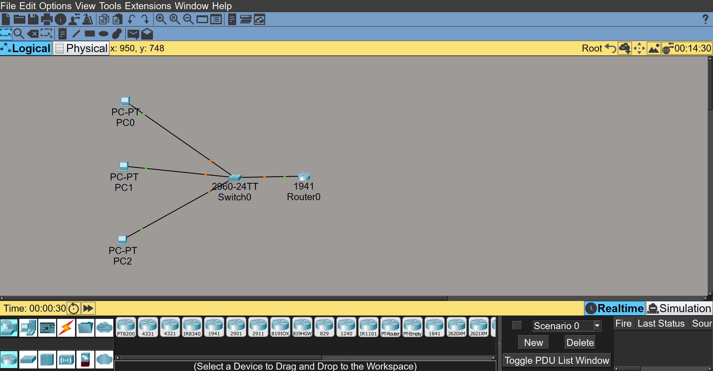

# Cisco Packet TracerでRouter on a Stick

## 構成図


## ネットワーク構成
| 機器 | VLAN | IPアドレス|
|------|------|-----------|
| PC0 | VLAN10 | 192.168.10.1 |
| PC1 | VLAN10 | 192.168.10.2 |
| PC2 | VLAN20 | 192.168.20.1 |
| Router | - | 192.168.10.254 / 192.168.20.254 |

## 構築でのポイント
- SwitchとRouter間はTrunkポート(802.1Q)で接続
- RouterにサブインターフェースでVLAN間ルーティングを実現
- 異なるVLAN間(今回ではVLAN10とVLAN20)の通信はRouterを経由する

## 動作確認
- PC0 -> PC1 (VLAN10内通信) ping成功
- PC0 -> PC2 (VLAN10とVLAN20間通信) ping成功

## 設定内容

### Switch
```
switch> enable
switch# configure terminal
switch(config)# vlan10
switch(config-vlan)# name VLAN10
switch(config-vlan)# exit

switch(config)# vlan20
switch(config-vlan)# name VLAN20
switch(config-vlan)# exit
```
#### PC0とSwitchの接続
```
switch(config)# interface FastEthernet0/1
switch(config-if)# switchport mode access
switch(config-if)# switchport access vlan 10
```

#### PC1とSwitchの接続
```
switch(config)# interface FastEthernet0/2
switch(config-if)# switchport mode access
switch(config-if)# switchport access vlan 10
```

#### PC2とSwitchの接続
```
switch(config)# interface FastEthernet0/3
switch(config-if)# switchport mode access
switch(config-if)# switchport access vlan 20
```

#### SwitchとRouterの接続
```
switch(config)# interface FastEthernet0/4
switch(config-if)# switchport mode trunk
```

### Routerの設定
```
Router> enable
Router# configure terminal
Router(config)# interface GigabitEthernet0/0
Router(config-if)# no shutdown

Router(config)# interface GigabitEthernet0/0.10
Router(config-subif)# encapsulation dot1Q 10
Router(config-subif)# ip address 192.168.10.254 255.255.255.0
Router(config-subif)# exit

Router(config)# interface GigabitEthernet0/0.20
Router(config-subif)# encapsulation dot1Q 20
Router(config-subif)# ip address 192.168.20.254 255.255.255.0
Router(config-subif)# exit
```