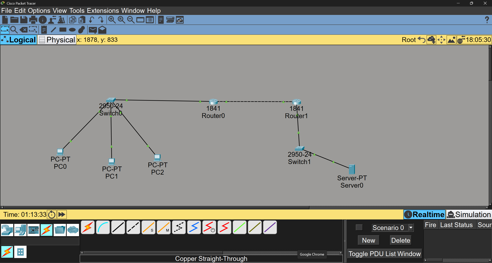
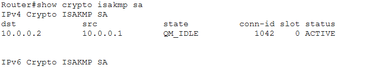
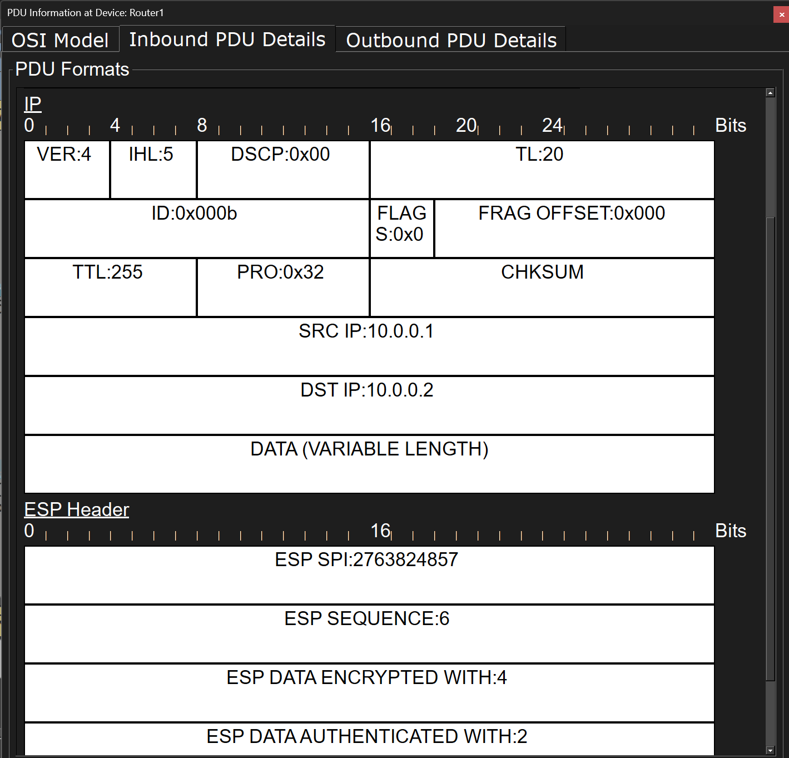
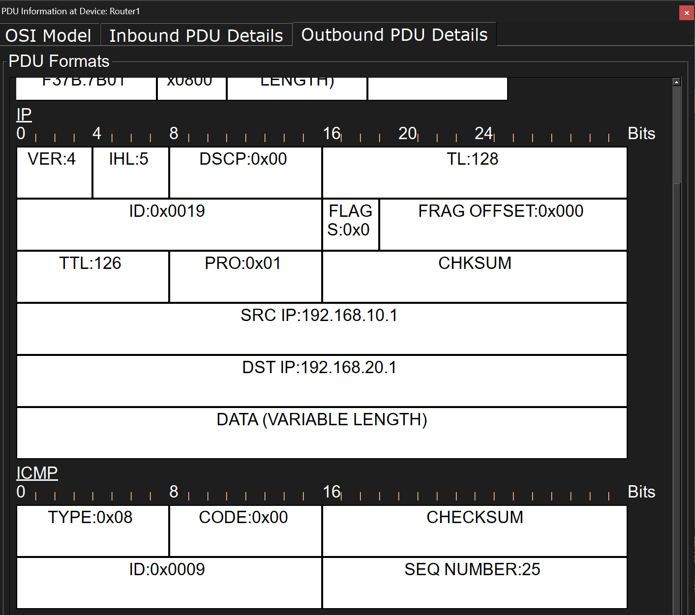

# cisco packet tracerで拠点間VPN（IPsec）構築

## 概要
Cisco Packet TracerでIPsec VPNを用いた
拠点間VPNを構築しました。
拠点AのPC3台から拠点BのWebサーバーへの
通信をVPNで暗号化しました。

## 構成図


## 使用機器
| 機器 | 型番 | 台数 |
|---|---|---|
| PC | PC-PT | 3台 |
| サーバー | Server-PT | 1台 |
| スイッチ | 2950-24 | 2台 |
| ルーター | 1841 | 2台 |

## IPアドレス設計
| 機器 | IPアドレス |
|---|---|
| PC0 | 192.168.10.1 |
| PC1 | 192.168.10.2 |
| PC2 | 192.168.10.3 |
| Router0 LAN側 | 192.168.10.254 |
| Router0 WAN側 | 10.0.0.1 |
| Router1 WAN側 | 10.0.0.2 |
| Router1 LAN側 | 192.168.20.254 |
| Server0 | 192.168.20.1 |

## VPNの設定内容
| 設定 | 値 |
|---|---|
| IKEバージョン | IKEv1 |
| 暗号化アルゴリズム | AES |
| ハッシュ関数 | SHA |
| 認証方式 | 事前共有鍵(pre-shared key) |
| 鍵交換方式 | DH Group 2 |
| トランスフォームセット | ESP-AES / ESP-SHA-HMAC |

## 設定コマンド（Router0）
```
// IKEポリシー
crypto isakmp policy 10
 encryption aes
 hash sha
 authentication pre-share
 group 2

// 事前共有鍵
crypto isakmp key cisco123 address 10.0.0.2

// トランスフォームセット
crypto ipsec transform-set MYSET esp-aes esp-sha-hmac

// アクセスリスト
access-list 100 permit ip 192.168.10.0 0.0.0.255 192.168.20.0 0.0.0.255

// クリプトマップ
crypto map MYMAP 10 ipsec-isakmp
 set peer 10.0.0.2
 set transform-set MYSET
 match address 100

// インターフェースに適用
interface GigabitEthernet0/1
 crypto map MYMAP
```

## 確認したこと

### VPNトンネルの確立
show crypto isakmp saでQM_IDLE・ACTIVEを確認しました。


### WAN間の暗号化（Inbound）
Router1に入ってくるパケットは
ESPヘッダーが付いており
データが暗号化されていることを確認しました。


### LAN側での復号（Outbound）
Router1から出ていくパケットは
ESPが復号されICMPとして転送されることを
確認しました。


## 学んだこと

### IKEフェーズ1
- IKEポリシーで暗号化アルゴリズム・ハッシュ関数・認証方式・鍵交換方式(DHグループ)を設定
- 事前共有鍵で相手を認証
- ISAKMPトンネルを確立する

### IKEフェーズ2
- トランスフォームセットで実際のデータの暗号化方式を設定
- アクセスリストで暗号化する通信を指定
- クリプトマップで設定をまとめてインターフェースに適用
- 実際のIPsecトンネルを確立する

### その他
- WAN間はESPで暗号化・LAN側では復号される仕組み
- show crypto isakmp saでVPNトンネルの状態を確認できる